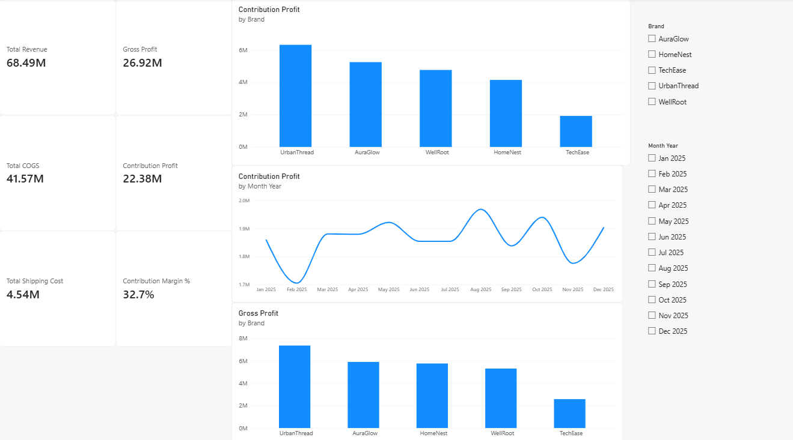

# D2C Merchant Growth & Profitability Analytics

> **End-to-end business analytics project for diagnosing D2C merchant growth, conversion, customer retention, marketing efficiency, and profitability.**

This project simulates a merchant analytics workflow for a D2C commerce platform. It combines **SQL, Python, Power BI, and DAX** to transform raw e-commerce data into actionable business insights and growth recommendations.

---

## 📌 Project Overview

D2C brands need to grow revenue while maintaining healthy margins, improving conversion, retaining customers, and allocating marketing spend efficiently.

This project analyzes five synthetic D2C brands across a 12-month period to answer questions such as:

- Which brands generate the most revenue and contribution profit?
- Where are conversion opportunities in the customer funnel?
- Which brands have stronger customer retention?
- How efficiently is marketing spend being converted into revenue?
- Which brands require profitability or cost-efficiency intervention?
- Where should growth efforts be prioritized?

The final output is an interactive **Power BI dashboard** supported by SQL analysis and Python-based exploratory analysis.

> **Data Disclaimer:** All merchant, customer, product, transaction, marketing, and funnel data used in this project is synthetic and created specifically for portfolio analysis. It does not represent real merchant performance.

---

# 🎯 Business Objective

The primary objective is to identify **data-backed growth opportunities** for D2C merchants by analyzing:

- Revenue and order performance
- Average Order Value (AOV)
- Conversion funnel performance
- Customer retention
- Marketing efficiency
- Contribution profit
- Contribution margin
- Brand-level performance
- Growth and profitability trade-offs

The analysis follows a practical growth consulting approach:

**Measure → Diagnose → Identify Opportunity → Recommend Action**

---

# 🏪 Brands Analyzed

The dataset represents five fictional D2C brands operating across different categories:

| Brand | Category |
|---|---|
| AuraGlow | Beauty |
| UrbanThread | Fashion |
| HomeNest | Home & Lifestyle |
| TechEase | Electronics Accessories |
| WellRoot | Wellness |

---

# 🔄 Analytics Workflow

```text
                RAW DATA
                    │
                    ▼
            Data Preparation
                    │
                    ▼
               SQL Analysis
                    │
                    ▼
          Python EDA & Analysis
                    │
                    ▼
             Power BI + DAX
                    │
                    ▼
          Performance Diagnosis
                    │
                    ▼
        Growth Opportunities
                    │
                    ▼
       Business Recommendations
       ---

# 📊 Power BI Dashboard

The Power BI dashboard contains five analytical views designed to move from overall performance analysis to detailed growth diagnosis.

## 1. Executive Overview

Provides a high-level view of:

- Total Revenue
- Total Orders
- Average Order Value
- Contribution Profit
- Contribution Margin
- Blended ROAS
- Monthly Revenue
- Brand-level performance


---

## 2. Conversion Funnel

Analyzes the customer journey from website sessions to completed purchases.

**Sessions → Product Views → Add to Cart → Checkout → Purchases**


---

## 3. Marketing & Customers

Analyzes:

- Marketing Spend
- Impressions
- Clicks
- CTR
- Customer Acquisition
- Customer Revenue
- Repeat Customer Rate


---

## 4. Profitability

Analyzes merchant profitability through:

- Revenue
- COGS
- Shipping Cost
- Gross Profit
- Contribution Profit
- Contribution Margin



---

## 5. Growth Opportunities & Action Plan

The final dashboard combines brand-level profitability, conversion, retention, and revenue analysis to identify actionable growth opportunities.

